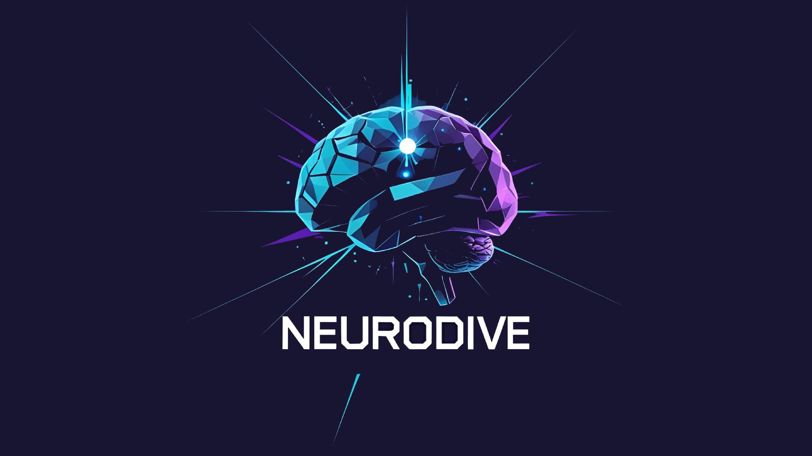

  

## Team Name

## Team Members
- ***Kaan Avdan*** - Product Owner
- ***Ahsen Büşra Nur Güngör*** - Scrum Master
- ***Eşref Bakar*** - 3D/2D Artist
- ***Mustafa Toprak Sezgin*** - Developer
- ***Ece Koçak*** - Developer

## Game Name
NeuroDive

## Product Backlog List
- [U-43 Trello Sprint Board - 1](https://trello.com/b/Dkt6f6eS/1-sprint)
- [U-43 Trello Sprint Board - 2](https://trello.com/b/PlpaYQrY/2-sprint)
- [U-43 Trello Sprint Board - 3](https://trello.com/b/V8sbhcHa/sprint-3)

## Game Description
NeuroDive is an isometric puzzle/strategy game that blends science fiction and psychological thriller elements. The player infiltrates the minds of targeted individuals to extract valuable information. Throughout the game, the player explores various environments to gather clues about the target, manipulates the surroundings to create optimal conditions for a neural breach, and ultimately enters a surreal and hostile mental landscape to retrieve the data and complete the mission.

## Game Features
- 3D
- Singleplayer
- Adventure/Puzzle
- Interactive Quests
- Low-poly
- Offline

## Target Group
- 7 +
- Indie game lovers
- Exploration and Adventure Lovers

## Marketing Strategy
- We believe that our game will be a highly enjoyable game due to its adventurous and strategic structure. In line with these goals, we have decided to market our game on Steam with a price tag of $2.

## Links
- [Check Out Our Product]()
- [Watch Trailer on Youtube](https://www.youtube.com/watch?v=LpNVf8sczqU)

---
# **SPRINT 1**

   |  |
   |:---------------------------------:|

- It has been decided that the score evaluation for the sprint will be 10.
- Score completion logic: The backlog score that must be completed throughout the project is expected to be 30. The number of points to be completed for the first Sprint was determined as 10, and the target score was reached by obtaining 10 points.Each task in the first sprint was considered as 1 point.

### **Sprint 1 Notes**
- At the beginning of the first sprint the team has presented different ideas and decided the basic elements of the game.
- The tasks were decided afterwards.  

  **To Do List:**
- Programming the isometric camera controls
- Coding the character mechanics
- Coding the mini games
- Designing the main menu 

### **Sprint 1 Board**
   |  |
   |:---------------------------------:|
   | Sprint 1 board                         |

### **Daily Scrum**

* Daily scrum was held via WhatsApp and Google Meet. Google Meet meeting notes can be found on Trello as cards in the "Meeting Logs" list.

   |  |
   |:---------------------------------:|
   | Initially, communication was established via WhatsApp, and WhatsApp was preferred for daily communication                         |

   |  |
   |:---------------------------------:|
   | Google Meet was preferred for planning and collaborative work.                         |

   |  |
   |:---------------------------------:|
   | Recordings of Google Meet meetings can be found on Trello as cards in the "Meeting Logs" list                         |

 
### **Development Progress**
* 3 mini games were programmed in our game. Main Menu design was done.

   |  |  |
   |:---------------------------------:|:-----------------------------------:|
   | Main Menu Design                        | Minigame                     |

* Character movement mechanics and interaction system coded. Camera controls programmed.

   |  |  |
   |:---------------------------------:|:-----------------------------------:|
   | Interaction System                        | Camera Controls                         |

* The basic logic scheme of the game has been created.

   |  |
   |:---------------------------------:|
   | Logic Scheme                       |

* Work has begun on new mini games.

   |  |
   |:---------------------------------:|
   | New Minigame Progress                        |

 ### **Sprint Review**
- At the end of Sprint 1, the team met and the Sprint was reviewed. The intended tasks have all been completed.
Sprint Review participants:

 ### **Sprint Retrospective**
- The score for Sprint 1 is 20.

 ### **Sprint Retrospective**
- aaa
