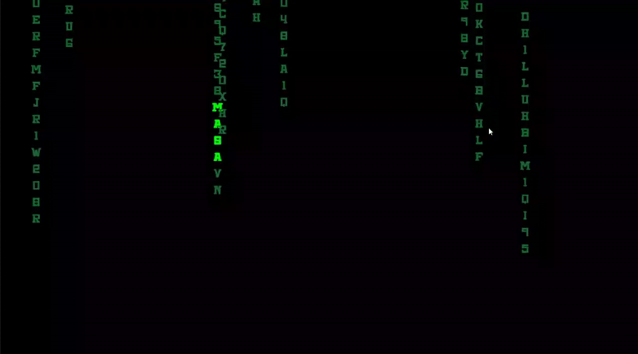

  

## Team Name

## Team Members
- ***xxxxx*** - Product Owner
- ***Ahsen Büşra Nur Güngör*** - Scrum Master
- ***xxxxxx*** - Developer
- ***xxxxxx*** - Developer

## Game Name
xxx

## Product Backlog List
- [U43 Unity Trello Sprint Board - 1](https://trello.com/b/Dkt6f6eS/1-sprint)
- [U43 Unity Trello Sprint Board - 2](https://trello.com/b/PlpaYQrY/2-sprint)
- [U43 Unity Trello Sprint Board - 3](https://trello.com/b/V8sbhcHa/sprint-3)

## Game Description
xxx

## Game Features
- 3D
- Singleplayer
- Story Driven Game
- Adventure
- Action RPG
- Offline

## Target Group
- 7 +
- Children: The game’s cute aesthetic, simple controls, and heartwarming story make it appealing to younger players.
- Parents and Families: The non-violent, positive themes make it a suitable choice for family gaming sessions.
- Casual Gamers: The easy-to-pick-up gameplay and charming characters attract those looking for a lighthearted and enjoyable experience.

## Links
- [Download Game on itch.io](https://itch.io/)
- [Watch Trailer on Youtube](https://www.youtube.com/)
- [Game Design Document](https://docs.google.com/)
- [Used Assets](https://docs.google.com/)

---
# **SPRINT 1**

   |  |
   |:---------------------------------:|

- xxx

### **Sprint 1 Notes**
- xxx  

  **To Do List:**
- xxx

### **Sprint 1 Board**
   |  |
   |:---------------------------------:|
   | Sprint 1 board                         |

### **Daily Scrum**

* xxx

   |  |
   |:---------------------------------:|
   | xxx           |

   |  |
   |:---------------------------------:|
   | xxx                         |

   |  |
   |:---------------------------------:|
   |xxx                        |

   |  |
   |:---------------------------------:|
   | xxx                       |

 
### **Development Progress**
* xxx
   |  |  |
   |:---------------------------------:|:-----------------------------------:|
   | xxx                       | xxx                     |

* xxx

   |  |  |
   |:---------------------------------:|:-----------------------------------:|
   |xxx                       | xxx                        |

* xxx

   |  |
   |:---------------------------------:|
   | xxx                        |

* xxx

   |  |
   |:---------------------------------:|
   |xxx                        |

* xxx

   |  |
   |:---------------------------------:|
   | xxx                      |

 ### **Sprint Review**
- xxx

 ### **Sprint Retrospective**
- xxx

---
# **SPRINT 2**

   |  |
   |:---------------------------------:|

- xxx
  
### **Sprint 2 Notes**
- xxx  

  **To Do List:**
- xxx

### **Sprint 2 Board**
   |  |
   |:---------------------------------:|
   | Sprint 2 board                         |

### **Daily Scrum**

* xxx
  
   |  |
   |:---------------------------------:|
   | WhatsApp meeting logs 1                        |

   |  |
   |:---------------------------------:|
   | WhatsApp meeting logs 2                        |

   |  |
   |:---------------------------------:|
   |xxx                 |

   |  |
   |:---------------------------------:|
   | Trello meeting logs                        |

 
### **Development Progress**
* xxx

   |  |  |
   |:---------------------------------:|:-----------------------------------:|
   | xxx                    |xxx                   |

* xxx

   |  |  |
   |:---------------------------------:|:-----------------------------------:|
   | xxx                     | xxx                    |

* xxx

   |  |
   |:---------------------------------:|
   | xxx                        |

* xxx

   |  |
   |:---------------------------------:|
   | xxx                    |

* xxx

   |  |
   |:---------------------------------:|
   | xxx                      |

   |  |
   |:---------------------------------:|
   | xxx                      |

   |  |
   |:---------------------------------:|
   | xxx                    |

* xxx

   |  |
   |:---------------------------------:|
   | xxx                   |

 ### **Sprint Review**
- xxx

 ### **Sprint Retrospective**
- xxx

---
# **SPRINT 3**

   |  |
   |:---------------------------------:|

- xxx

 
### **Sprint 3 Notes**
- xxx

  **To Do List:**
- xxx

### **Sprint 3 Board**
   | |
   |:---------------------------------:|
   | Sprint 3 board                         |

### **Daily Scrum**

* xxx

   |  |
   |:---------------------------------:|
   | WhatsApp meeting logs                        |

   |  |
   |:---------------------------------:|
   | Discord meeting logs                        |

   |  |
   |:---------------------------------:|
   | Trello meeting logs                        |

 
### **Development Progress**

* xxx

   |  |
   |:---------------------------------:|
   | xxx                       |

* xxx
   |  |
   |:---------------------------------:|
   | xxx              |
 

 ### **Sprint Review**
- xxx

 ### **Sprint Retrospective**
- xxx
